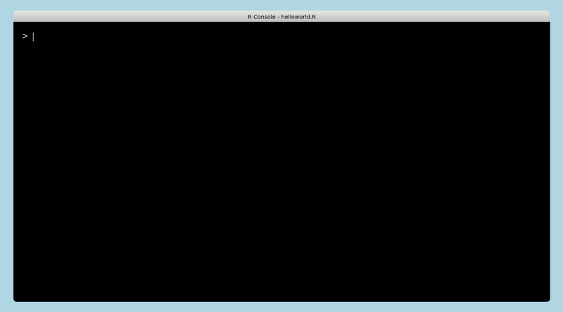

<!-- README.md is generated from README.Rmd. Please edit that file -->

# typedR

[typed.js](https://github.com/mattboldt/typed.js) is a popular
JavaScript library to generate string typing animation. This package is
a R wrapper for it.

## Installation

This package can be installed by using the `devtools` package. It is
suggested to have the newest version of `htmlwidgets` and have a
relatively new version of Rstudio.

``` r
devtools::install_github("chrk623/typedR")
```

## Examples

``` r
library(typedR)
typedR(text = "apply(matrix(1:4, ncol = 2), 2, mean)", theme = "mac",
       ratio = 0.8, speed = 10, background_col = "lightblue")
```



## Converting to GIF

**TODO: Some resoultions are not working properly, need to
investigate.**

To render the html documents into gif. A headless browser is used to
capture it, to do this the Chrome Dev Tool is used, the `chromote`
package provides this functionality. Then images are rendered into gif
via the `magick` package.

This function can be used on other html documents, see help
page.

``` r
mywidget = typedR(text = "apply(matrix(1:4, nc = 2), 2, mean)", theme = "mac",
       ratio = 0.8, speed = 500, background_col = "lightblue",
      width = 640, height = 480)
htmlwidgets::saveWidget(mywidget, "mywidget.html")
library(chromote)
library(magick)
html2gif(file_in = "mywidget.html", file_out = "mygif.gif")
```
